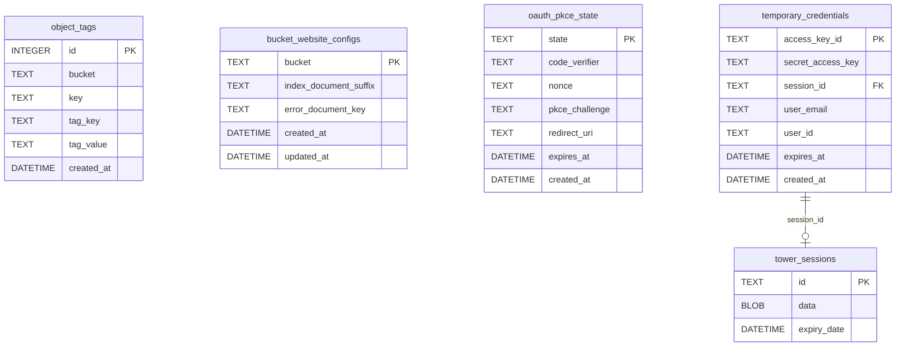
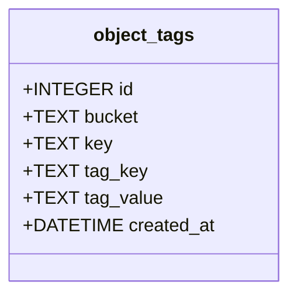
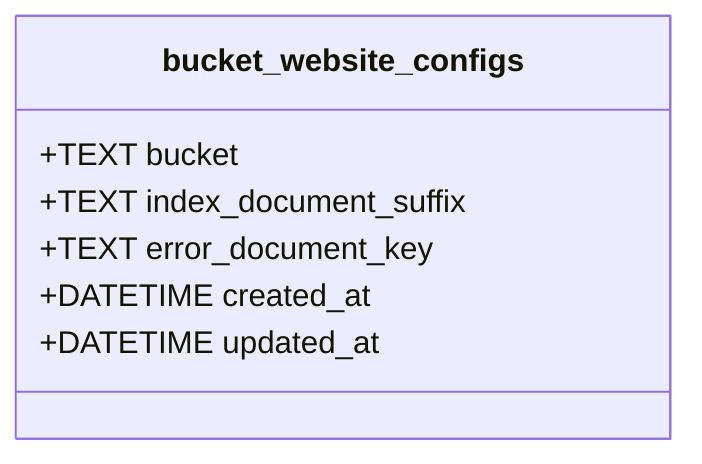
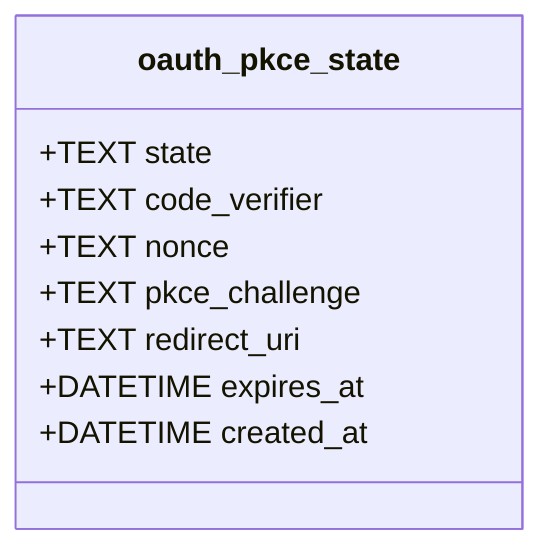
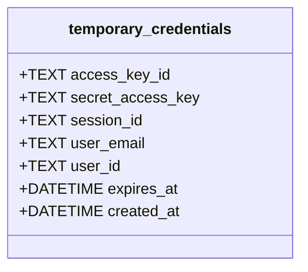
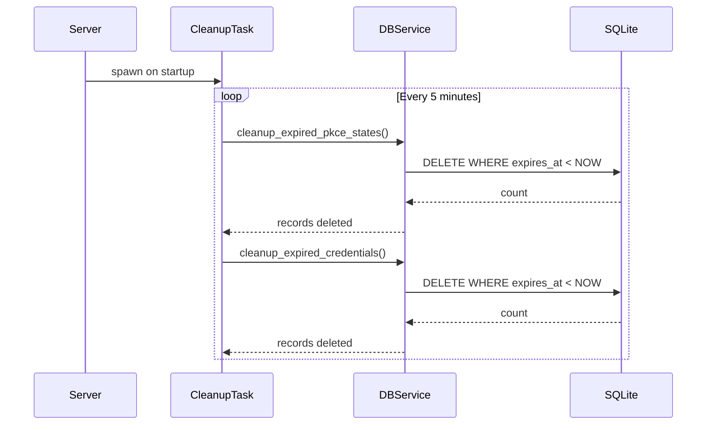

# Database Design

## Overview

Crabcakes uses SQLite for storing metadata, sessions, and temporary credentials. The database is located at `{config_dir}/crabcakes.sqlite3` (default: `./config/crabcakes.sqlite3`) and is automatically created on first startup.

Database migrations are managed using SeaORM's migration framework and run automatically on server startup.

## Entity Relationship Diagram



## Tables

### object_tags

Stores S3 object tags with validation and indexing for efficient lookups.



**Constraints:**
- Primary key: `id`
- Unique index: `(bucket, key, tag_key)` - ensures one value per tag key per object
- Lookup index: `(bucket, key)` - optimizes tag retrieval for objects

**Validation:**
- Maximum 10 tags per object
- Tag keys: maximum 128 characters
- Tag values: maximum 256 characters

**Purpose:** Supports S3 tagging operations (PutObjectTagging, GetObjectTagging, DeleteObjectTagging)

### bucket_website_configs

Configuration for S3 static website hosting mode per bucket.



**Constraints:**
- Primary key: `bucket`
- `index_document_suffix` is required (NOT NULL)
- `error_document_key` is optional (nullable)

**Purpose:**
- Enables S3-compatible static website hosting per bucket
- Configures index document suffix (e.g., "index.html") for directory requests
- Optionally configures error document (e.g., "error.html") for 404 responses
- Updated via PutBucketWebsite, GetBucketWebsite, DeleteBucketWebsite operations

**Behavior:**
- When configured, `GET /bucket/` automatically serves `bucket/index.html` (or configured suffix)
- Directory paths ending with `/` append the index document suffix
- 404 errors automatically serve the error document if configured
- Error document served with 404 status code and proper headers

### oauth_pkce_state

Temporary storage for OAuth 2.0 PKCE flow state during OIDC authentication.



**Constraints:**
- Primary key: `state` (OAuth state parameter)
- Index: `expires_at` - optimizes cleanup operations

**Purpose:**
- Stores PKCE (Proof Key for Code Exchange) parameters during OAuth flow
- Validates callback requests from OIDC provider
- Automatically cleaned up by background task after expiration

### temporary_credentials

AWS-style temporary credentials generated for authenticated web UI users.



**Constraints:**
- Primary key: `access_key_id`
- Index: `session_id` - links to tower-sessions for session management
- Index: `expires_at` - optimizes cleanup operations

**Purpose:**
- Generated on successful OIDC login
- Allows web UI users to make S3 API calls
- Linked to user session for lifecycle management
- Automatically cleaned up after expiration

### tower_sessions

Auto-managed session store for the admin web UI (created by tower-sessions library).

**Purpose:**
- Manages user sessions for admin UI
- Stores session data including authentication state
- Referenced by `temporary_credentials.session_id`

## Database Operations

### DBService API

The `DBService` struct (`src/db/service.rs`) provides all database operations:

**Tag Operations:**
```rust
put_tags(bucket: &str, key: &str, tags: &[(String, String)])
get_tags(bucket: &str, key: &str) -> Vec<(String, String)>
delete_tags(bucket: &str, key: &str)
```

**Bucket Website Configuration Operations:**
```rust
put_website_config(bucket: &str, index_suffix: &str, error_key: Option<&str>)
get_website_config(bucket: &str) -> Option<BucketWebsiteConfig>
delete_website_config(bucket: &str)
```

**OAuth PKCE Operations:**
```rust
store_pkce_state(state, code_verifier, nonce, pkce_challenge, redirect_uri, expires_at)
get_pkce_state(state: &str) -> Option<PkceState>
delete_pkce_state(state: &str)
cleanup_expired_pkce_states() -> u64
```

**Temporary Credentials Operations:**
```rust
store_temporary_credentials(access_key_id, secret_access_key, session_id, user_email, user_id, expires_at)
get_temporary_credentials(access_key_id: &str) -> Option<TemporaryCredential>
get_credentials_by_session(session_id: &str) -> Vec<TemporaryCredential>
delete_temporary_credentials(access_key_id: &str)
delete_credentials_by_session(session_id: &str)
cleanup_expired_credentials() -> u64
```

## Background Cleanup

A background task (`CleanupTask` in `src/cleanup.rs`) runs every 5 minutes to remove expired data:



**Cleanup Operations:**
- Removes expired OAuth PKCE states
- Removes expired temporary credentials
- Logs info messages when records are cleaned
- Continues running on errors (with error logging)

## Migrations

### Location

Migrations are stored in `src/db/migration/`:
- Format: `mYYYYMMDD_HHMMSS_description.rs`
- Each migration implements `up()` and `down()` methods
- Registered in `src/db/migration/mod.rs`

### Adding a New Migration

1. Create migration file:
   ```rust
   // src/db/migration/m20250119_000001_create_my_table.rs
   use sea_orm_migration::prelude::*;

   pub struct Migration;

   impl MigrationName for Migration {
       fn name(&self) -> &str {
           "m20250119_000001_create_my_table"
       }
   }

   #[async_trait::async_trait]
   impl MigrationTrait for Migration {
       async fn up(&self, manager: &SchemaManager) -> Result<(), DbErr> {
           manager.create_table(/* ... */).await
       }

       async fn down(&self, manager: &SchemaManager) -> Result<(), DbErr> {
           manager.drop_table(/* ... */).await
       }
   }
   ```

2. Register in `src/db/migration/mod.rs`:
   ```rust
   vec![
       // ...existing migrations...
       Box::new(m20250119_000001_create_my_table::Migration),
   ]
   ```

3. Migration runs automatically on next server startup

### Existing Migrations

Current migrations create:
- `object_tags` table with indexes
- `oauth_pkce_state` table with indexes
- `temporary_credentials` table with indexes
- `bucket_website_configs` table

## Testing Recommendations

**Unit Tests:**
- Use in-memory database: `sqlite::memory:`
- Fastest option for testing business logic
- No cleanup required

**Integration Tests:**
- Use temporary directory for database file
- Tests full migration and persistence
- Cleanup temp directory after test

Example:
```rust
// In-memory for unit tests
let db = Database::connect("sqlite::memory:").await?;

// Temp directory for integration tests
let temp_dir = tempdir()?;
let db_path = temp_dir.path().join("test.sqlite3");
let db = Database::connect(format!("sqlite:{}", db_path.display())).await?;
```
